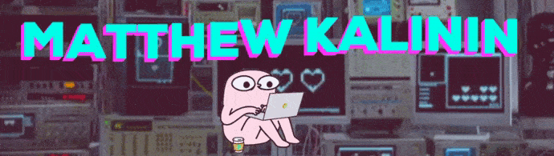

## Hi! 👋

My name is Matthew Kalinin. I am a frontend developer. I work on all sorts of web projects for fun 👻 or for studying 🎓.

## What I do (What I work with) 🔨

- Frontend:
  
  
  
- Backend:
  
  
  

## Just a section for everyone 🚶‍♂️

- 🌱 I'm trying to do really cool big projects
- 📫 You can write to me by email at matvey.kalinin2001@yandex.ru.
